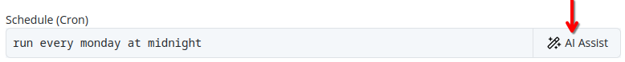
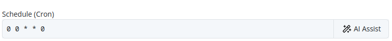

# AI Assist
Throughout the Pextra CloudEnvironment® web interface, you will find the **AI Assist** button, which provides context-sensitive suggestions and assistance. Describe your task in natural language, and the AI Assist feature will generate relevant suggestions to facilitate your work[^1].

See the example below for a demonstration of how to use the AI Assist feature.

*Before*:

*After*:

> [!NOTE]
> An administrator of the organization [must configure at least one AI provider](../../organizations/ai-providers/add.md) for AI features to function. If no AI providers are configured, AI features will not be available in the web interface.

## Notes

[^1]: Pextra AI features are powered by third-party AI providers, as configured in your organization settings. The quality and accuracy of responses may vary based on the provider and the specific task at hand. Always review AI-generated content.