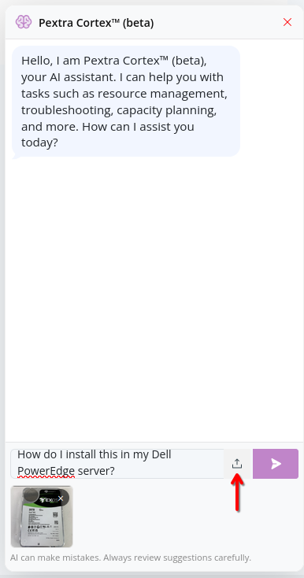

# Pextra Cortex™
Pextra Cortex™ is an advanced AI agent integrated into the Pextra CloudEnvironment® web interface. It is designed to assist users in planning and executing complex orchestration tasks, by leveraging the open-source [Model Context Protocol (MCP)](https://modelcontextprotocol.io/) standard. Pextra Cortex™ can understand high-level user instructions and screenshots and translate them into actionable, executable plans[^1].

> [!NOTE]
> An administrator of the organization [must configure at least one AI provider](../../organizations/ai-providers/add.md) for AI features to function. If no AI providers are configured, AI features will not be available in the web interface.

## Usage
1. To access Pextra Cortex™, click on the message bubble icon in the bottom-right corner of the web interface:

    

2. Provide instructions in natural language, then click the **Send** button. You can also attach screenshots:

	
	

3. Pextra Cortex™ will spend a few moments thinking. During this time, it may ask for clarifications or additional information to better understand your request:

    

4. A response will be generated:

    

5. For safety reasons, before executing any AI-generated plans, Pextra Cortex™ asks for user confirmation:

    

## Running Locally
> [!NOTE]
> It is recommended to use Pextra Cortex™ through the web interface for the best experience, as it is fully integrated and optimized for Pextra CloudEnvironment®.

Refer to the [MCP server repository](https://github.com/PextraCloud/pce-mcp) that powers Pextra Cortex™. This allows you to use a desktop app or command-line interface (CLI) to build AI agents that interact with Pextra CloudEnvironment®.

## Notes

[^1]: Pextra AI features are powered by third-party AI providers, as configured in your organization settings. The quality and accuracy of responses may vary based on the provider and the specific task at hand. Always review AI-generated content.