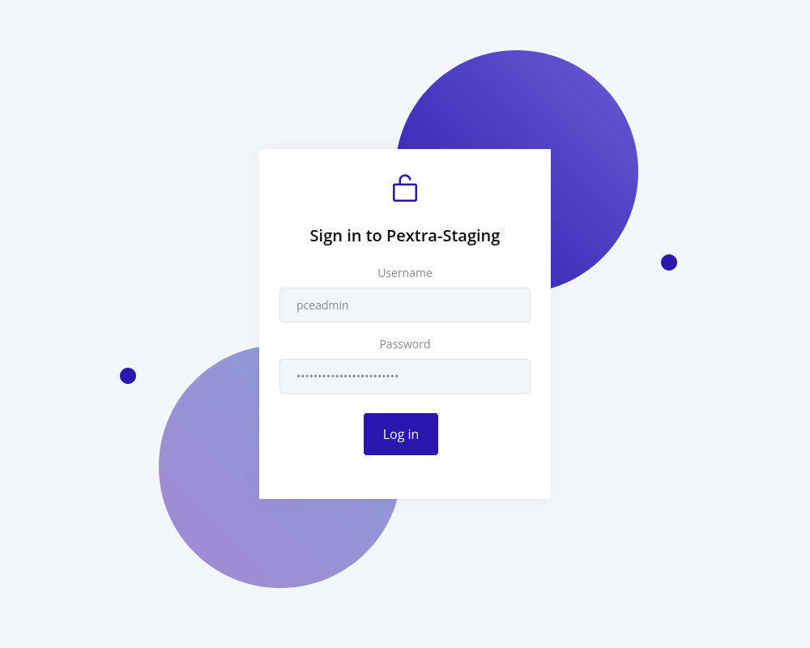

# Logging In
To log in to the web interface, use the credentials you set during the installation process. The default username is `pceadmin`, and the password is the one you specified during installation:

Once logged in, you will be directed to the current node's page[^1].

## Notes

[^1]: The IP address that you connect to (this is especially relevant for nodes in a cluster). The node that you are currently connected to is shown with a light green dot next to the node's entry in the resource tree. All requests are proxied to the node that you are connected to.