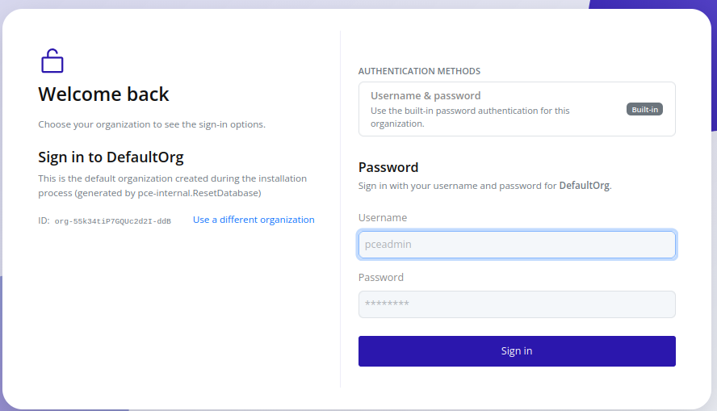
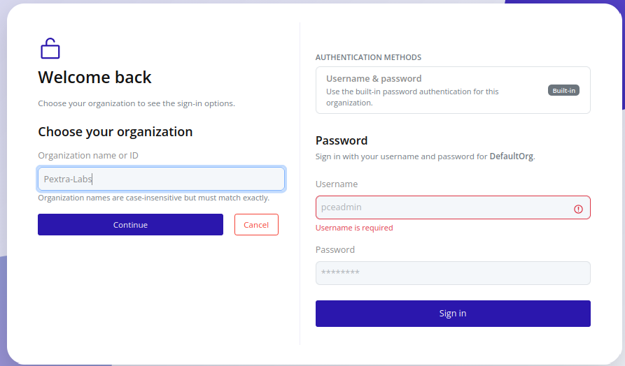
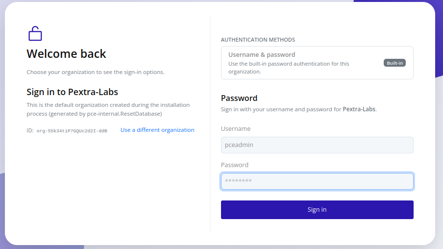
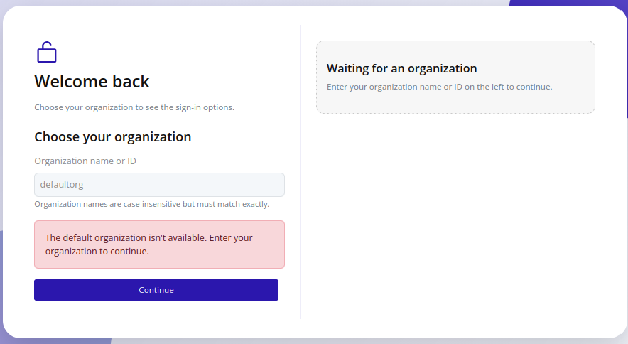

# Logging In
There are two main steps to access the web interface:
1. Selecting the target organization (if applicable)
2. Authenticating with user credentials

## Organization Discovery (optional)
>[!NOTE]
>For security reasons, multi-organization deployments require you to explicitly select the target organization before logging in.

Most deployments run a single organization, so you can usually proceed straight to authentication. 

To select an organization:
1. Open the login page. The UI preselects `DefaultOrg` (created during installation):
  
2. Click **Use a different organization**, and enter the organization **Name** or **ID** for an exact, case-insensitive match.
  
3. Confirm the selection. If the organization exists and your user belongs to it, the authentication form appears.
  

In the case that the default organization is renamed or deleted, the login page displays an error and prompts you to select a different organization:
  

>[!TIP]
>Keep a short list of approved organization IDs (`org-...`) for multi-tenant deployments. Single-tenant admins can ignore this step entirely.

## Authentication

1. Use the built-in username/password or an external identity provider (IdP), if configured:
    - For IdP logins, click the relevant button and follow the provider's authentication flow.
    - For built-in username/password, enter the username and password (the default username is `pceadmin`, and the password is set during installation). 
3. If successful, you are redirected to the main dashboard[^1].

## Notes

[^1]: The IP address that you connect to (this is especially relevant for nodes in a cluster). The node that you are currently connected to is shown with a light green dot next to the node's entry in the resource tree. All requests are proxied to the node that you are connected to.