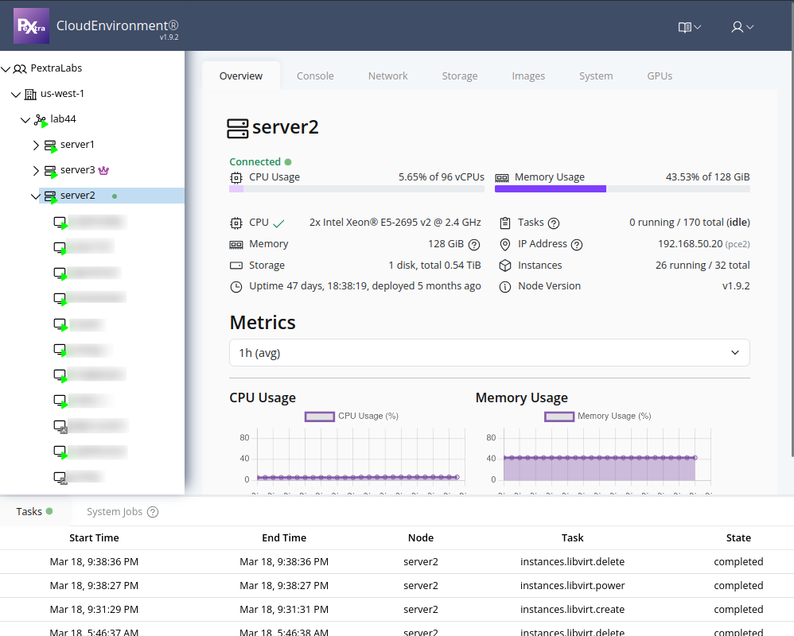

# Resource Tree
On the left side of the web interface, you will find a tree view that displays the hierarchy of your deployment. This view provides a complete overview of all organizations, datacenters, clusters, nodes, and instances within your deployment. You can expand and collapse the tree's nodes to navigate through the different levels of your infrastructure:
