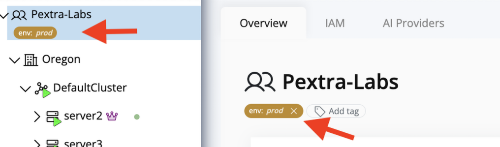

# Add a Tag
You can assign tags from each resource's detail page.

>[!NOTE]
>You must have the `tag.create` permission on the resource in order to add tags.

1. Click **Add Tag** on the resource page.
  
2. The button converts into two inline fields: **Key** and **Value**
3. Enter the key and optional value. Tag keys must be unique per resource.
4. Select the check icon to save the tag or the **X** icon to cancel.
  
5. Confirm the new tag appears before the **Add Tag** button. The UI immediately propagates the change to dropdowns and the resource tree.
  

>[!IMPORTANT]
> Tags with keys starting with `pce_` are reserved for system use. Attempting to create or edit a tag with this prefix will fail.