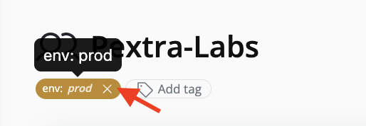

# Remove a Tag
You can remove tags from each resource's detail page.

>[!NOTE]
>You must have the `tag.delete` permission on the resource in order to remove tags.

1. On the resource page, locate the tag you want to remove.
2. Click the **X** icon on the tag pill.
  
3. The tag is immediately removed. The UI propagates the change to dropdowns and the resource tree.

>[!IMPORTANT]
> Tags with keys starting with `pce_` are reserved for system use. Attempting to create, edit, or delete a tag with this prefix will fail.