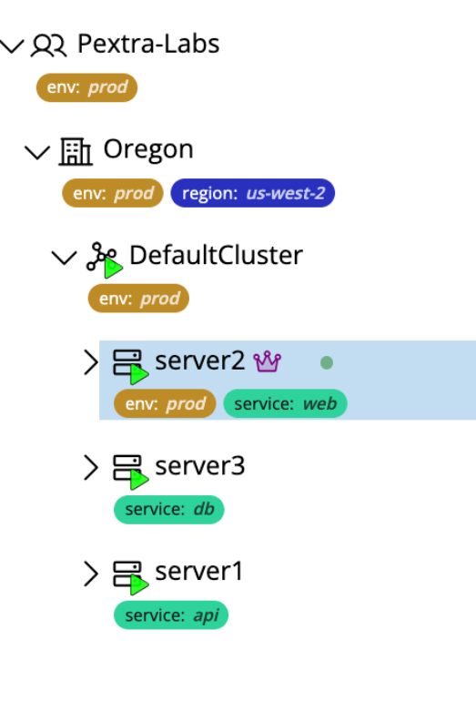
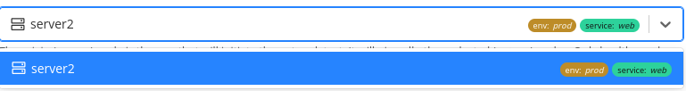

# View Tags
Tags appear as color-coded pills that display the key and optional value. Tag values are abbreviated, and can be viewed in full by hovering over the pill.

>[!NOTE]
>You must have the `tag.list` permission on the resource in order to remove tags.

## Resource Tree
Tags appear next to the resource name in the resource tree:

## Dropdowns & Selectors
Tags also appear in any dropdown that lists the resource:
